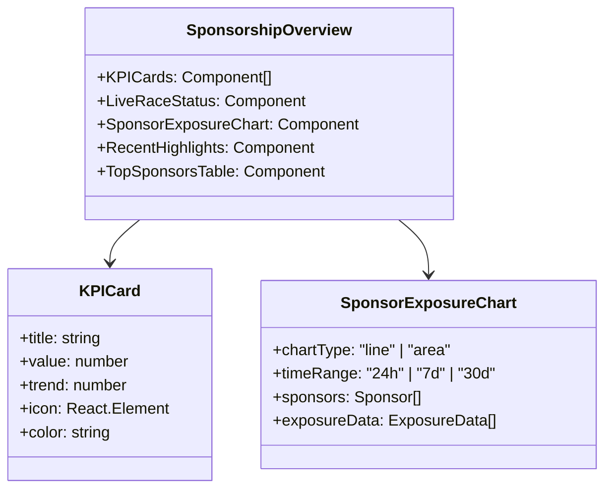
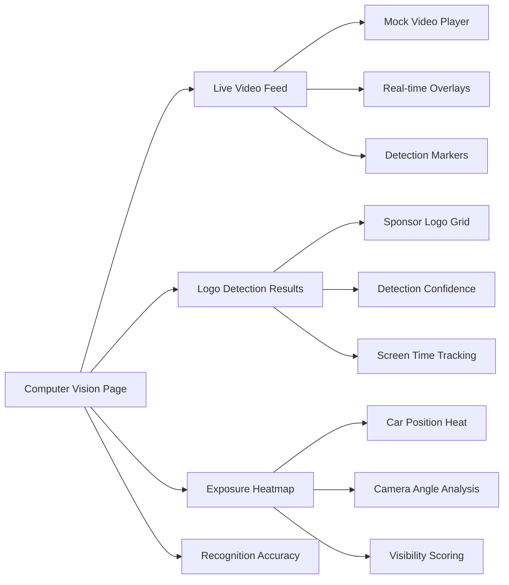
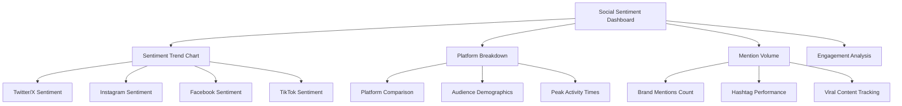
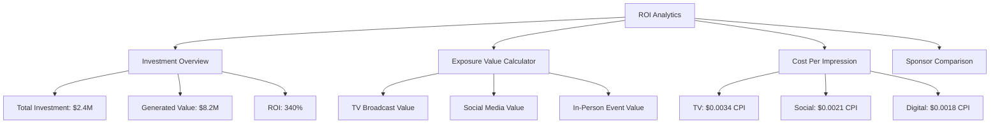
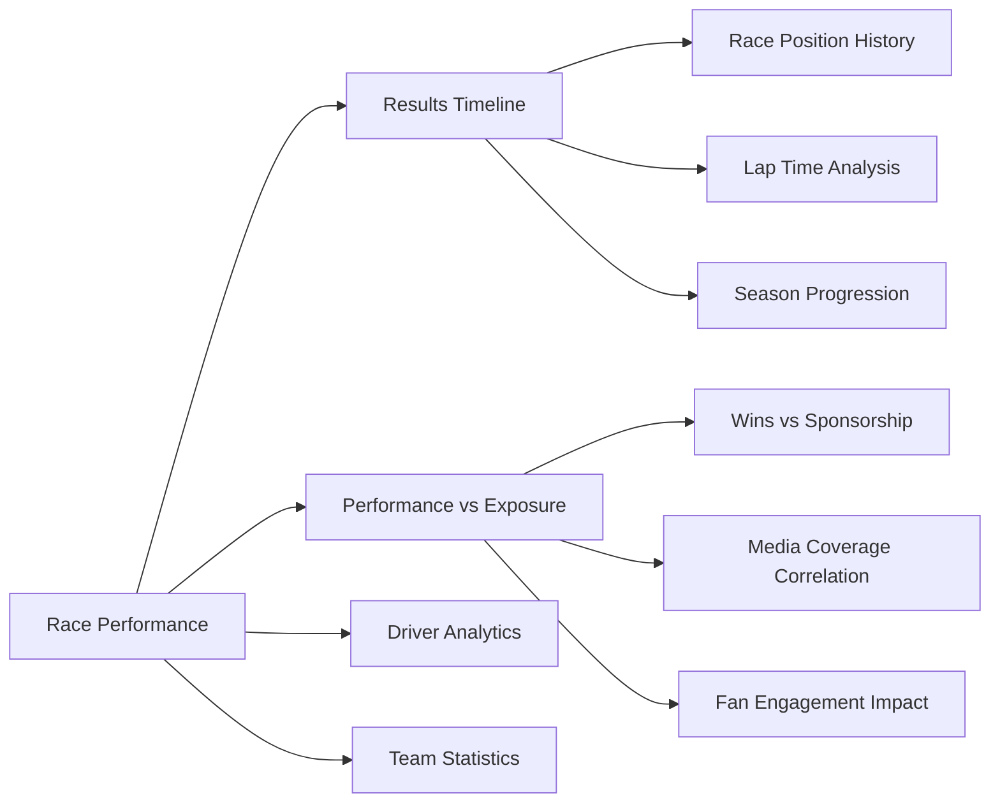

# ASD Motorsports Sponsorship Analytics Dashboard Design

## Overview

This design document outlines the adaptation of the shadcn/Next.js boilerplate to create a comprehensive sponsorship analytics dashboard for ASD Motorsports, a super late model racing team. The system will showcase advanced sponsorship tracking capabilities including social media sentiment analysis, computer vision-based sponsorship exposure tracking, and comprehensive ROI metrics similar to platforms like RelometŕĶĺics.

### Target Users
- Racing team management and marketing personnel
- Sponsor brand managers and marketing teams
- Business development executives
- Race event organizers and promoters

### Core Value Proposition
- Real-time sponsorship exposure tracking using computer vision
- Social media sentiment analysis and brand mention monitoring
- Comprehensive ROI analytics for sponsor investments
- Race performance correlation with sponsorship effectiveness
- Visual dashboard showcasing sponsorship value to current and potential sponsors

## Technology Stack & Dependencies

### Current Foundation
- **Frontend**: Next.js 15.1.6, React 19 RC, TypeScript 5.4.5
- **UI Framework**: Shadcn UI 0.2.3, Tailwind CSS 3.4.3
- **Charts**: ApexCharts (react-apexcharts)
- **Authentication**: Supabase Auth
- **Database**: Supabase (PostgreSQL)

### New Dependencies Required
- **Computer Vision**: Mock CV analytics display
- **Social Media APIs**: Mock social platform data integration
- **Advanced Charts**: Additional ApexCharts configurations
- **Real-time Updates**: WebSocket simulation for live race data
- **Video Analysis**: Mock video frame analysis components

## Component Architecture

### Dashboard Structure Overview

```mermaid
graph TB
    A[ASD Motorsports Dashboard] --> B[Overview Page]
    A --> C[Sponsorship Tracking]
    A --> D[Social Sentiment]
    A --> E[Race Performance]
    A --> F[ROI Analytics]
    A --> G[Computer Vision]
    A --> H[Reports]
    
    B --> B1[KPI Cards]
    B --> B2[Live Race Status]
    B --> B3[Recent Highlights]
    
    C --> C1[Sponsor Exposure Metrics]
    C --> C2[Screen Time Analysis]
    C --> C3[Logo Detection Results]
    
    D --> D1[Sentiment Trends]
    D --> D2[Social Media Mentions]
    D --> D3[Brand Engagement]
    
    E --> E1[Race Results Correlation]
    E --> E2[Performance Metrics]
    E --> E3[Driver Analytics]
    
    F --> F1[Investment vs Exposure]
    F --> F2[Cost Per Impression]
    F --> F3[Conversion Metrics]
    
    G --> G1[Live Video Analysis]
    G --> G2[Logo Recognition]
    G --> G3[Exposure Heatmaps]
```



### New Route Structure

```typescript
// Updated routes configuration
export const routes: IRoute[] = [
  {
    name: 'Sponsorship Overview',
    path: '/dashboard/sponsorship/overview',
    icon: <HiOutlineChartBar className="-mt-[7px] h-4 w-4 stroke-2 text-inherit" />,
    collapse: false
  },
  {
    name: 'Computer Vision',
    path: '/dashboard/sponsorship/computer-vision',
    icon: <HiOutlineEye className="-mt-[7px] h-4 w-4 stroke-2 text-inherit" />,
    collapse: false
  },
  {
    name: 'Social Sentiment',
    path: '/dashboard/sponsorship/social-sentiment',
    icon: <HiOutlineHeart className="-mt-[7px] h-4 w-4 stroke-2 text-inherit" />,
    collapse: false
  },
  {
    name: 'ROI Analytics',
    path: '/dashboard/sponsorship/roi-analytics',
    icon: <HiOutlineCurrencyDollar className="-mt-[7px] h-4 w-4 stroke-2 text-inherit" />,
    collapse: false
  },
  {
    name: 'Race Performance',
    path: '/dashboard/sponsorship/race-performance',
    icon: <HiOutlineTrophy className="-mt-[7px] h-4 w-4 stroke-2 text-inherit" />,
    collapse: false
  },
  {
    name: 'Sponsor Reports',
    path: '/dashboard/sponsorship/reports',
    icon: <HiOutlineDocumentReport className="-mt-[7px] h-4 w-4 stroke-2 text-inherit" />,
    collapse: false
  }
];
```

## Page-Level Architecture

### 1. Sponsorship Overview Dashboard

**Layout Structure:**


**Key Metrics Displayed:**
- Total Sponsorship Value: $2.4M
- Race Season Exposure: 14.2M impressions
- Social Media Reach: 892K interactions
- Average Screen Time per Sponsor: 47 seconds
- Sentiment Score: 8.3/10
- ROI Average: 340%

### 2. Computer Vision Analytics

**Component Structure:**


**Features:**
- Live race footage simulation with overlay detection boxes
- Sponsor logo recognition accuracy dashboard (95.7% average)
- Real-time exposure timing and positioning analysis
- Heatmap visualization of optimal sponsor placement zones
- Frame-by-frame analysis results table

### 3. Social Sentiment Analysis

**Data Visualization:**


**Mock Data Sources:**
- Twitter/X: 1,247 mentions, 78% positive sentiment
- Instagram: 892 posts, 85% positive sentiment
- Facebook: 456 interactions, 72% positive sentiment
- TikTok: 234 videos, 91% positive sentiment

### 4. ROI Analytics Dashboard

**Financial Metrics Visualization:**


### 5. Race Performance Correlation

**Performance Analytics:**


## Data Models & Schema

### Sponsorship Tracking Data

```typescript
interface SponsorshipExposure {
  id: string;
  sponsorId: string;
  raceId: string;
  timestamp: Date;
  exposureType: 'tv_broadcast' | 'social_media' | 'in_person';
  duration: number; // seconds
  visibility: 'high' | 'medium' | 'low';
  screenPosition: {
    x: number;
    y: number;
    width: number;
    height: number;
  };
  confidenceScore: number; // 0-1
}

interface SocialMention {
  id: string;
  platform: 'twitter' | 'instagram' | 'facebook' | 'tiktok';
  timestamp: Date;
  content: string;
  author: string;
  engagement: {
    likes: number;
    shares: number;
    comments: number;
  };
  sentiment: 'positive' | 'neutral' | 'negative';
  sentimentScore: number; // -1 to 1
  mentions: string[]; // sponsor brands mentioned
}

interface Sponsor {
  id: string;
  name: string;
  logo: string;
  investment: number;
  contractStart: Date;
  contractEnd: Date;
  tier: 'primary' | 'secondary' | 'associate';
  placement: 'car' | 'suit' | 'helmet' | 'trackside';
}

interface RacePerformance {
  id: string;
  raceId: string;
  driverId: string;
  position: number;
  lapTimes: number[];
  averageSpeed: number;
  incidents: number;
  mediaValue: number;
  sponsorExposureTime: Record<string, number>;
}
```

### Mock Data Generation

```typescript
// Mock data generators for development
const generateMockExposureData = (): SponsorshipExposure[] => {
  // Generate realistic sponsorship exposure data
  // Simulates 24-hour race coverage with multiple sponsors
};

const generateMockSocialData = (): SocialMention[] => {
  // Generate social media mentions across platforms
  // Includes realistic engagement metrics and sentiment
};

const generateMockROIData = () => {
  // Calculate ROI metrics based on exposure and investment
  // Provides sponsor-specific performance analytics
};
```

## Chart Configurations & Visualizations

### ApexCharts Extensions

```typescript
// Sponsorship exposure timeline chart
const exposureTimelineConfig = {
  chart: {
    type: 'area',
    height: 350,
    zoom: { enabled: false },
    animations: { enabled: true }
  },
  dataLabels: { enabled: false },
  stroke: { curve: 'smooth', width: 2 },
  xaxis: {
    type: 'datetime',
    categories: [], // Race timestamps
  },
  yaxis: {
    title: { text: 'Exposure Time (seconds)' }
  },
  fill: {
    type: 'gradient',
    gradient: {
      shadeIntensity: 1,
      opacityFrom: 0.7,
      opacityTo: 0.3
    }
  },
  colors: ['#FF6B6B', '#4ECDC4', '#45B7D1', '#96CEB4', '#FFEAA7']
};

// Sentiment analysis radar chart
const sentimentRadarConfig = {
  chart: {
    type: 'radar',
    height: 350
  },
  plotOptions: {
    radar: {
      size: 140,
      polygons: {
        strokeColors: '#e9e9e9',
        fill: { colors: ['#f8f8f8', '#fff'] }
      }
    }
  },
  xaxis: {
    categories: ['Twitter/X', 'Instagram', 'Facebook', 'TikTok', 'YouTube']
  },
  yaxis: { show: false },
  markers: { size: 4, colors: ['#FF6B6B'] }
};

// ROI comparison bar chart
const roiComparisonConfig = {
  chart: {
    type: 'bar',
    height: 350,
    horizontal: true
  },
  plotOptions: {
    bar: {
      borderRadius: 4,
      dataLabels: { position: 'top' }
    }
  },
  dataLabels: {
    enabled: true,
    formatter: (val: number) => `${val}%`
  },
  xaxis: {
    categories: [], // Sponsor names
    title: { text: 'ROI Percentage' }
  }
};
```

### Custom Chart Components

```typescript
// Heatmap for sponsor placement effectiveness
const SponsorPlacementHeatmap = ({ data }: { data: PlacementData[] }) => {
  return (
    <div className="relative w-full h-96 bg-gray-100 rounded-lg overflow-hidden">
      {/* Car silhouette with sponsor placement zones */}
      <div className="absolute inset-0 bg-car-silhouette">
        {data.map((placement, index) => (
          <div
            key={index}
            className={`absolute rounded-lg ${getHeatmapColor(placement.effectiveness)}`}
            style={{
              left: `${placement.x}%`,
              top: `${placement.y}%`,
              width: `${placement.width}%`,
              height: `${placement.height}%`
            }}
            title={`${placement.sponsor}: ${placement.effectiveness}% effective`}
          />
        ))}
      </div>
    </div>
  );
};

// Live computer vision detection overlay
const CVDetectionOverlay = ({ detections }: { detections: Detection[] }) => {
  return (
    <div className="relative w-full h-64 bg-black rounded-lg overflow-hidden">
      <video className="w-full h-full object-cover" autoPlay muted loop>
        <source src="/mock-race-footage.mp4" type="video/mp4" />
      </video>
      <div className="absolute inset-0">
        {detections.map((detection, index) => (
          <div
            key={index}
            className="absolute border-2 border-green-400"
            style={{
              left: `${detection.x}%`,
              top: `${detection.y}%`,
              width: `${detection.width}%`,
              height: `${detection.height}%`
            }}
          >
            <div className="bg-green-400 text-black text-xs px-2 py-1 -top-6 absolute">
              {detection.sponsor} ({Math.round(detection.confidence * 100)}%)
            </div>
          </div>
        ))}
      </div>
    </div>
  );
};
```

## User Interface Design Specifications

### Color Scheme & Branding

```css
/* ASD Motorsports Theme Extension */
:root {
  --asd-primary: #DC2626; /* Racing red */
  --asd-secondary: #1F2937; /* Carbon black */
  --asd-accent: #F59E0B; /* Racing yellow */
  --asd-success: #10B981; /* Performance green */
  --asd-warning: #F59E0B; /* Caution yellow */
  --asd-error: #EF4444; /* Alert red */
  --asd-background: #F9FAFB; /* Light background */
  --asd-surface: #FFFFFF; /* Card surfaces */
  --asd-text-primary: #111827; /* Primary text */
  --asd-text-secondary: #6B7280; /* Secondary text */
}

/* Racing-themed gradients */
.racing-gradient {
  background: linear-gradient(135deg, var(--asd-primary) 0%, var(--asd-accent) 100%);
}

.performance-gradient {
  background: linear-gradient(135deg, var(--asd-success) 0%, var(--asd-accent) 100%);
}
```

### Custom UI Components

```typescript
// KPI Card Component
const KPICard = ({ 
  title, 
  value, 
  trend, 
  icon, 
  color = 'primary' 
}: KPICardProps) => {
  return (
    <div className="bg-white dark:bg-gray-800 rounded-xl p-6 shadow-lg border border-gray-200 dark:border-gray-700">
      <div className="flex items-center justify-between mb-4">
        <div className={`p-3 rounded-lg bg-${color}-100 dark:bg-${color}-900`}>
          {icon}
        </div>
        <div className={`text-sm font-medium ${trend >= 0 ? 'text-green-600' : 'text-red-600'}`}>
          {trend >= 0 ? '↗' : '↘'} {Math.abs(trend)}%
        </div>
      </div>
      <h3 className="text-2xl font-bold text-gray-900 dark:text-white mb-1">
        {value.toLocaleString()}
      </h3>
      <p className="text-sm text-gray-600 dark:text-gray-400">
        {title}
      </p>
    </div>
  );
};

// Live Status Indicator
const LiveStatusIndicator = ({ isLive }: { isLive: boolean }) => {
  return (
    <div className="flex items-center space-x-2">
      <div className={`w-3 h-3 rounded-full ${isLive ? 'bg-red-500 animate-pulse' : 'bg-gray-400'}`} />
      <span className="text-sm font-medium">
        {isLive ? 'LIVE RACE' : 'RACE ENDED'}
      </span>
    </div>
  );
};

// Sponsor Logo Recognition Result
const LogoRecognitionResult = ({ 
  sponsor, 
  confidence, 
  screenTime 
}: LogoRecognitionProps) => {
  return (
    <div className="flex items-center justify-between p-4 bg-gray-50 dark:bg-gray-800 rounded-lg">
      <div className="flex items-center space-x-3">
        
        <div>
          <h4 className="font-medium text-gray-900 dark:text-white">
            {sponsor.name}
          </h4>
          <p className="text-sm text-gray-600 dark:text-gray-400">
            {screenTime}s screen time
          </p>
        </div>
      </div>
      <div className="text-right">
        <div className="text-lg font-bold text-green-600">
          {Math.round(confidence * 100)}%
        </div>
        <div className="text-xs text-gray-500">confidence</div>
      </div>
    </div>
  );
};
```

### Responsive Design Breakpoints

```typescript
// Responsive grid configurations
const sponsorshipGridConfig = {
  mobile: 'grid-cols-1',
  tablet: 'grid-cols-2',
  desktop: 'grid-cols-3',
  large: 'grid-cols-4'
};

const chartContainerConfig = {
  mobile: 'h-64',
  tablet: 'h-80',
  desktop: 'h-96',
  large: 'h-[28rem]'
};
```

## Page Layout Specifications

### 1. Overview Dashboard Layout

```typescript
const SponsorshipOverviewLayout = () => {
  return (
    <DashboardLayout
      title="ASD Motorsports Sponsorship Analytics"
      description="Real-time sponsorship tracking and ROI analysis"
    >
      {/* Header with live status and race info */}
      <div className="mb-6 flex justify-between items-center">
        <div>
          <h1 className="text-3xl font-bold text-gray-900 dark:text-white">
            Sponsorship Dashboard
          </h1>
          <p className="text-gray-600 dark:text-gray-400">
            Talladega Superspeedway - Race Weekend
          </p>
        </div>
        <LiveStatusIndicator isLive={true} />
      </div>

      {/* KPI Cards Grid */}
      <div className="grid grid-cols-1 md:grid-cols-2 lg:grid-cols-4 gap-6 mb-8">
        <KPICard 
          title="Total Sponsorship Value"
          value={2400000}
          trend={12.5}
          icon={<HiOutlineCurrencyDollar />}
          color="primary"
        />
        <KPICard 
          title="Race Season Exposure"
          value={14200000}
          trend={8.3}
          icon={<HiOutlineEye />}
          color="success"
        />
        <KPICard 
          title="Social Media Reach"
          value={892000}
          trend={-2.1}
          icon={<HiOutlineHeart />}
          color="warning"
        />
        <KPICard 
          title="Average ROI"
          value={340}
          trend={15.7}
          icon={<HiOutlineChartBar />}
          color="secondary"
        />
      </div>

      {/* Main Chart and Quick Stats */}
      <div className="grid grid-cols-1 lg:grid-cols-3 gap-6 mb-8">
        <div className="lg:col-span-2">
          <SponsorExposureChart />
        </div>
        <div className="space-y-4">
          <TopSponsorsCard />
          <RecentHighlightsCard />
        </div>
      </div>

      {/* Data Tables */}
      <div className="grid grid-cols-1 xl:grid-cols-2 gap-6">
        <SponsorPerformanceTable />
        <SocialMentionsTable />
      </div>
    </DashboardLayout>
  );
};
```

### 2. Computer Vision Page Layout

```typescript
const ComputerVisionLayout = () => {
  return (
    <DashboardLayout
      title="Computer Vision Analytics"
      description="AI-powered sponsorship detection and tracking"
    >
      {/* Live Video Analysis Section */}
      <div className="mb-8">
        <h2 className="text-2xl font-bold mb-4">Live Race Analysis</h2>
        <div className="grid grid-cols-1 lg:grid-cols-2 gap-6">
          <CVDetectionOverlay detections={mockDetections} />
          <div className="space-y-4">
            <DetectionStatsCard />
            <ActiveSponsorsCard />
          </div>
        </div>
      </div>

      {/* Placement Effectiveness */}
      <div className="mb-8">
        <h2 className="text-2xl font-bold mb-4">Placement Effectiveness Heatmap</h2>
        <SponsorPlacementHeatmap data={placementData} />
      </div>

      {/* Recognition Results */}
      <div className="grid grid-cols-1 lg:grid-cols-2 gap-6">
        <LogoRecognitionResults />
        <ExposureTimeline />
      </div>
    </DashboardLayout>
  );
};
```

## Testing Strategy

### Component Testing Approach

```typescript
// Mock data for testing components
export const mockSponsorshipData = {
  sponsors: [
    {
      id: '1',
      name: 'Mobil 1',
      logo: '/sponsors/mobil1.png',
      investment: 500000,
      tier: 'primary' as const,
      placement: 'car' as const
    },
    {
      id: '2', 
      name: 'Goodyear',
      logo: '/sponsors/goodyear.png',
      investment: 300000,
      tier: 'secondary' as const,
      placement: 'trackside' as const
    }
  ],
  exposureData: [
    {
      timestamp: new Date('2024-01-15T14:30:00'),
      sponsorId: '1',
      duration: 45,
      visibility: 'high' as const,
      confidenceScore: 0.95
    }
  ],
  socialMentions: [
    {
      platform: 'twitter' as const,
      content: 'Great race by ASD Motorsports! #Mobil1 #Racing',
      sentiment: 'positive' as const,
      sentimentScore: 0.8,
      engagement: { likes: 127, shares: 23, comments: 8 }
    }
  ]
};

// Component testing utilities
export const renderWithDashboardContext = (component: React.ReactElement) => {
  return render(
    <DashboardContext.Provider value={mockDashboardState}>
      {component}
    </DashboardContext.Provider>
  );
};
```

### Visual Regression Testing

```typescript
// Storybook stories for visual testing
export const SponsorshipOverview = {
  args: {
    sponsors: mockSponsorshipData.sponsors,
    exposureData: mockSponsorshipData.exposureData,
    isLive: true
  }
};

export const ComputerVisionDemo = {
  args: {
    detections: mockDetections,
    videoSource: '/mock-race-footage.mp4'
  }
};
```

## Integration Specifications

### API Endpoint Simulation

```typescript
// Mock API endpoints for development
export const mockAPIEndpoints = {
  '/api/sponsorship/exposure': {
    method: 'GET',
    response: mockExposureData
  },
  '/api/sponsorship/social-sentiment': {
    method: 'GET', 
    response: mockSocialData
  },
  '/api/sponsorship/computer-vision/live': {
    method: 'GET',
    response: mockCVDetections
  },
  '/api/sponsorship/roi-analysis': {
    method: 'GET',
    response: mockROIData
  }
};

// WebSocket simulation for live updates
export const simulateWebSocketUpdates = () => {
  const mockSocket = {
    send: (data: any) => console.log('Mock WebSocket send:', data),
    addEventListener: (event: string, handler: Function) => {
      if (event === 'message') {
        // Simulate periodic updates
        setInterval(() => {
          handler({
            data: JSON.stringify({
              type: 'exposure_update',
              payload: generateMockExposureUpdate()
            })
          });
        }, 5000);
      }
    }
  };
  return mockSocket;
};
```

### Deployment Configuration

```yaml
# Additional environment variables needed
NEXT_PUBLIC_MOCK_DATA_ENABLED=true
NEXT_PUBLIC_WEBSOCKET_URL=ws://localhost:3001
NEXT_PUBLIC_CV_API_URL=http://localhost:3002
NEXT_PUBLIC_SOCIAL_API_URL=http://localhost:3003
```

This comprehensive design provides a complete blueprint for transforming the shadcn/Next.js boilerplate into a sophisticated sponsorship analytics dashboard for ASD Motorsports, showcasing the type of advanced analytics capabilities found in platforms like RelometrĂﾭcs while maintaining the existing architecture and design patterns.


